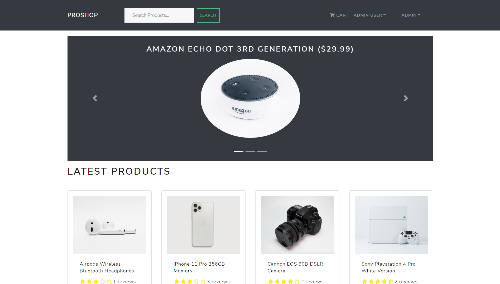

<p align="center">
  <a href="https://proshopeeapp.herokuapp.com/" rel="noopener">
 </a>
</p>

<h1 align="center"> <a href="https://proshopeeapp.herokuapp.com/"> PROSHOP SHOPPING APP </a> </h1>

<p align="center"> Click the above image to checkout my fully deployed website.
    <br> 
</p>

## 📝 Table of Contents

-   [About](#about)
-   [Getting Started](#getting_started)
-   [Built Using](#built_using)
-   [Authors](#authors)
-   [Acknowledgments](#acknowledgement)

## 🧐 About <a name = "about"></a>

This website is similar to commonly available shopping apps like amazon, flipkart etc. In this website I have implemented all the required features like login, payment with PayPal and many more such features like this.

## 🏁 Getting Started <a name = "getting_started"></a>

This website is created solely for the learning purpose and anyone can clone it. But for the production purpose it is missing some important updates.

### Installing and running on loacl server

Here is the step by step guide on how to install and deploy this website on you local server.

-   Step 1 Install nodejs 14 or higher (Recomended 14).
-   Step 2 Clone this repository.
-   Step 3 create a `.env` file in root and put these environment variables

```java
PORT = 5000
JWT_SECRET = <put a password of your choise>
NODE_ENV = <development>/<production>

// Create a mongoDB URI and paste it here.
// Sample URI
// MONGO_URI = mongodb+srv://<username>:<password>@cluster0.0vxdnkg.mongodb.net/
// test?retryWrites=true&w=majority
MONGO_URI = <Mongo uri>

// Sample ID
// AZwkJ1m9yGr_LibOMCvp_ZfHWpYHPH_MV2KaiMr1Wi4raUxMY8bV9ti-us4fb5_aGlMqdV17n78_Ckc1
// Go to https://developer.paypal.com/ and create your app. 
// It will give you the PayPal ID, you need to paste this id here.
PAYPAL_CLIENT_ID = <put your paypal ID>

```

-   Step 4 Go to root folder and use the command `npm install`.
-   Step 5 Go to frontend folder `cd frontend` and use the command `npm install`.
-   Step 7 Initially there will be no data so you can import sample data using command `node backend/seeder` in root folder.
-   Step 6 Your website will start running now, you can check `http://localhost:3000/`.

---

---

---


### Installing and deploying on Heroku server

-   Step 1 Install Heroku CLI for windows/ ubuntu.

-   Step 2 Create a file and name `Procfile` in root folder and the content should be :-

```
web: node backend/server.js
```

-   Step 3 Paste the heroku-postbuild script in root/package.json file

```json
    "heroku-postbuild": "NPM_CONFIG_PRODUCTION=false npm install --prefix frontend
    && npm run build --prefix frontend"
```

-   Step 4 Add this code to the `backend/server.js` file.  Also avoid one of the common mistakes and do not put this on the top of the file. This code needs to be at the bottom so that all the env variables can load, otherwise website might not run.

```java
if (process.env.NODE_ENV === 'production') {
  app.use(express.static(path.join(__dirname, '/frontend/build')))

  app.get('*', (req, res) =>
    res.sendFile(path.resolve(__dirname, 'frontend', 'build', 'index.html'))
  )
} else {
  app.get('/', (req, res) => {
    res.send('API is running....')
  })
}
```

-   Step 4 Go to command line and write in root folder

```bash
$ heroku login
$ heroku create <you-unique-app-name>
$ heroku git:remote -a <you-unique-app-name>
$ git push heroku master
```

-   Step 5 Add the `.env` file elements to the heroku in root folder.
-   Step 6 Your app is workin now.

## ⛏️ Built Using <a name = "built_using"></a>

-   [MongoDB](https://www.mongodb.com/) - Database
-   [Express](https://expressjs.com/) - Server Framework
-   [React](https://reactjs.org/) - Web Framework
-   [Heroku](https://www.heroku.com) - Deployment server
-   [NodeJs](https://nodejs.org/en/) - Server Environment

## ✍️ Authors <a name = "authors"></a>

-   [@Shrawan](https://github.com/agrawalshrawan245)

## ✍️ Acknowledgments <a name = "acknowledgments"></a>

-   [@Traversy](https://github.com/bradtraversy) - Idea & Initial work
